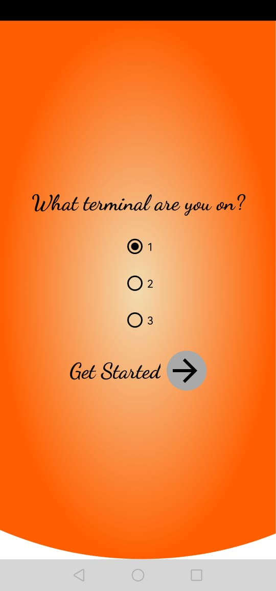
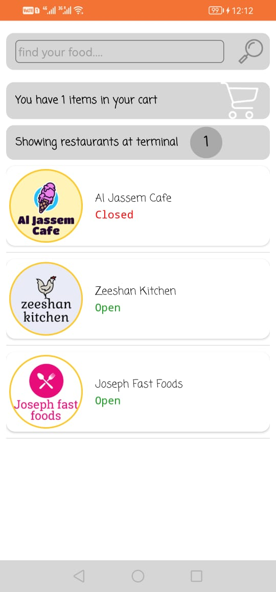
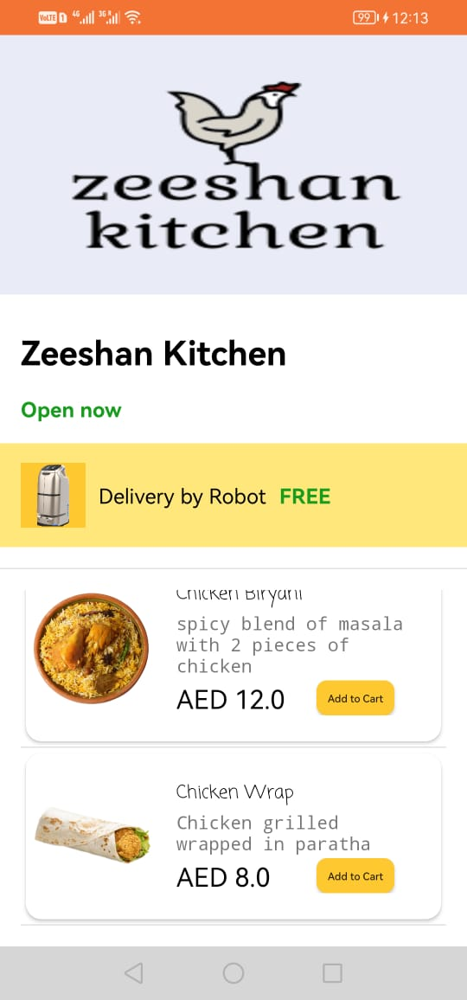
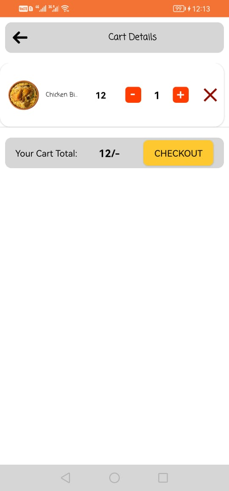
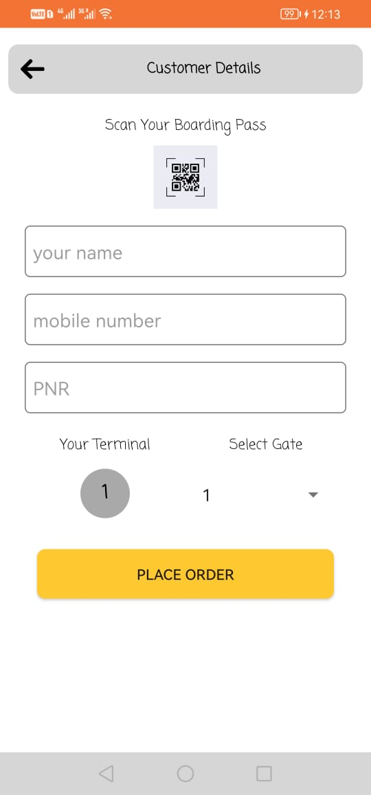
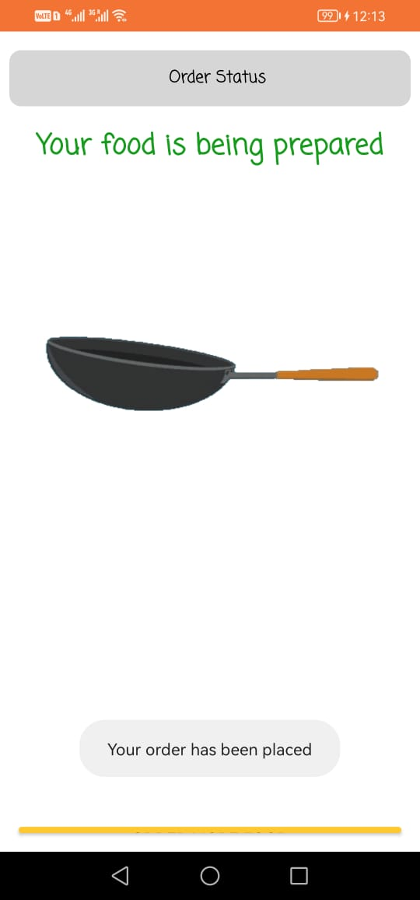

# Food Airport

## Overview

Food Airport is an innovative food ordering Android application designed for smartphones. Unlike typical food ordering apps, Food Airport utilizes robots for food delivery at boarding gates within airports. The app streamlines the food ordering process, and the delivery is managed by robots in designated areas at each gate. The app is developed using Java for Android development, integrates with Strapi CMS for backend management, and leverages Keenon robot APIs for efficient communication with the delivery robots.

## Features

- **Robot-assisted Food Delivery:** Utilizes robots for delivering food orders to designated areas at each boarding gate.
- **User-friendly Ordering:** Provides a seamless and user-friendly experience for ordering food from airport restaurants.
- **Gate-specific Delivery:** Ensures precise delivery to the specified gate area by utilizing robot communication.
- **Strapi CMS Integration:** Efficiently manages backend operations and content through Strapi CMS.
- **Keenon Robot APIs:** Integrates with Keenon robot APIs for smooth communication with the food delivery robots.

## Technology Stack

- **Frontend:** Java for Android development
- **Backend:** Strapi CMS APIs
- **Robot Communication:** Keenon Robot APIs

## Project Responsibilities

- **Android App Development:** Developed the Android application using Java, focusing on a user-friendly interface for efficient food ordering.
- **Strapi CMS Integration:** Integrated Strapi CMS APIs for backend management, ensuring streamlined content and order processing.
- **Robot Communication Integration:** Utilized Keenon robot APIs to enable effective communication between the app and the delivery robots.

## Outcome

Food Airport has revolutionized the food ordering experience at airports by introducing robot-assisted delivery. The app provides users with a convenient and efficient way to order food, and the integration with Keenon robot APIs ensures precise and timely deliveries to designated areas at each boarding gate.

## Screenshots

